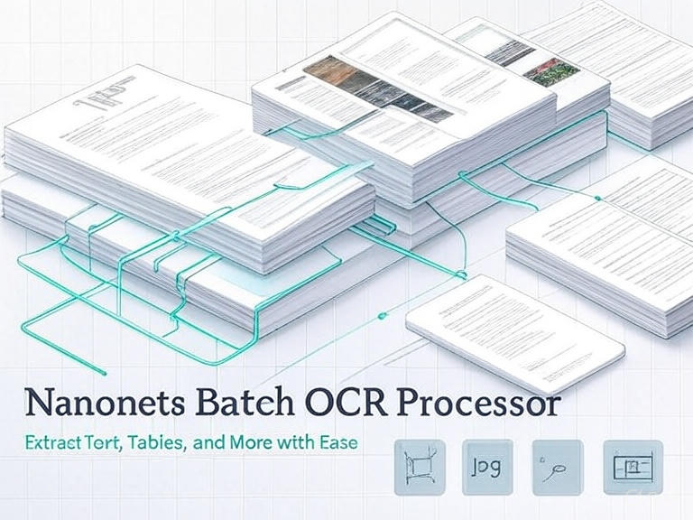
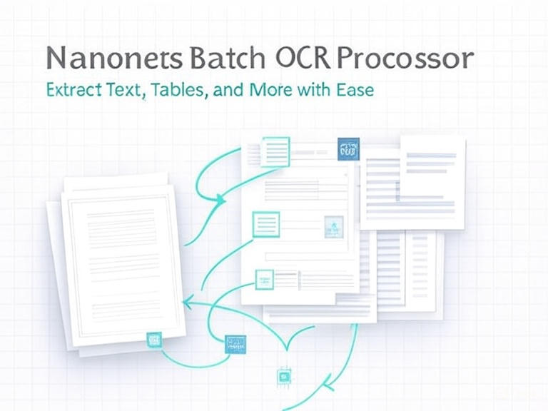

# Nanonets OCR Processor

A powerful batch OCR processing tool that extracts text from images and PDFs using the Nanonets OCR model. Now optimized for CPU usage by default with improved output readability.

## Features

- **CPU-First Processing**: Uses CPU by default for better compatibility and resource management
- **Multiple Output Formats**: Creates readable outputs in multiple formats
- **Comprehensive Analysis**: Detects tables, equations, images, watermarks, and page numbers
- **Progress Tracking**: Real-time processing progress with time estimates
- **Error Handling**: Robust error handling with detailed failure reporting

## Supported File Formats

- Images: `.jpg`, `.jpeg`, `.png`, `.tiff`, `.tif`
- Documents: `.pdf`

## Installation

### Prerequisites

- Python 3.8 or higher
- CUDA Toolkit (optional, for GPU acceleration)
- Git

### Option 1: Local Installation

1. **Clone the repository:**
```bash
git clone <repository-url>
cd OCR
```

2. **Create and activate virtual environment:**
```bash
# Create virtual environment
python3 -m venv ocr_env

# Activate virtual environment
# On Linux/Mac:
source ocr_env/bin/activate
# On Windows:
ocr_env\Scripts\activate
```

3. **Install dependencies:**
```bash

# Install remaining dependencies
pip install -r requirements.txt

# (GPU Option) Install flash-attention with no build isolation (recommended)
pip install flash-attn --no-build-isolation
```

2. **Prepare data directories:**
```bash

# Place your documents in the example_files directory (or specify custom input directory). Some files have already been included.
cp /path/to/your/documents/* example_files/
```

## Usage

### Basic Usage (CPU - Default)
```bash
# CPU: Use conservative defaults (batch-size 1, 1080p images)
python batch_ocr.py --cpu --batch-size 1 --pdf-chunk-size 1

# GPU 8GB RAM: Use conservative defaults (batch-size 1, 1080p images)
python batch_ocr.py --gpu --batch-size 1 --pdf-chunk-size 1

# GPU 16GB RAM: Increase batch size for better performance
python batch_ocr.py --gpu --batch-size 5 --pdf-chunk-size 2

```

### Custom Input/Output Directories
```bash
python batch_ocr.py --input-dir /path/to/data --output-dir /path/to/results
```

### Advanced Usage Examples
```bash
# Process with GPU, custom batch size, and directory
python batch_ocr.py --gpu --batch-size 8 --input-dir example_files --output-dir results

# Process PDFs with smaller chunks for memory efficiency
python batch_ocr.py --pdf-chunk-size 2 --max-image-width 1024 --max-image-height 1024

# Full custom configuration
python batch_ocr.py \
  --gpu \
  --input-dir "example_files" \
  --output-dir "results" \
  --batch-size 4 \
  --pdf-chunk-size 1 \
  --max-image-width 2048 \
  --max-image-height 2048
```

### Command Line Options

- `--cpu`: Use CPU for processing (default)
- `--gpu`: Use GPU for processing
- `--input-dir`: Input directory containing documents (default: `example_files`)
- `--output-dir`: Output directory for results (default: `extracted_text`)
- `--csv-file`: CSV file for results summary (default: `ocr_results.csv`)
- `--batch-size`: Number of files to process per batch (default: 2)
- `--pdf-chunk-size`: Number of PDF pages to process at once (default: 1)
- `--max-image-width`: Maximum image width in pixels (default: 1080)
- `--max-image-height`: Maximum image height in pixels (default: 1080)

**Note:** The `--cpu` and `--gpu` options are mutually exclusive. If neither is specified, CPU processing is used by default.

## Project Structure

```
OCR/
├── batch_ocr.py               # Main OCR processing script
├── requirements.txt           # Python dependencies
├── README.md                  # This file
├── .gitignore                 # Git exclusions
├── example_files/             # Sample input files directory
│   ├── a01-000u.png          # Example image files
│   ├── a01-003u.png
│   └── ...
└── extracted_text/            # Output directory (created when processing)
    ├── document1.md           # Individual markdown files for each document
    ├── document2.md
    └── ...
```

## Output Structure

The processor creates multiple output formats for better readability:

```
extracted_text/               # Default output directory
├── document1.md              # Individual markdown files for each document
├── document2.md
├── document3.md
└── ...
```

### Output Formats Explained

3. **Individual Text Files (`extracted_text/*.txt`)**
   - Separate text file for each processed document
   - Formatted with headers and metadata
   - Preserves OCR formatting (tables, equations, etc.)
   - Easy to read and search


## Example Output

### Individual Text File Format
```
================================================================================
OCR EXTRACTION RESULTS
================================================================================

DOCUMENT INFORMATION:
----------------------------------------
Filename: example.pdf
File Format: .pdf
File Size: 1,234,567 bytes
Created: 2025-06-26T22:10:37.102788

PROCESSING INFORMATION:
----------------------------------------
Processed: 2025-06-26T22:11:09.529471
Processing Time: 2.93 seconds
Pages Processed: 3

CONTENT ANALYSIS:
----------------------------------------
Word Count: 1,245
Character Count: 7,890
Contains Tables: Yes
Contains Equations: No
Contains Images: Yes
Contains Watermarks: No
Contains Page Numbers: Yes

EXTRACTED TEXT:
================================================================================

[Extracted text content here...]
```

## Performance

- **CPU Processing**: Optimized for CPU with appropriate data types
- **Memory Efficient**: Conservative defaults for systems with limited RAM
- **Progress Tracking**: Real-time progress updates with time estimates
- **Error Recovery**: Continues processing even if individual files fail

## Troubleshooting

### Runtime Issues

1. **Out of Memory**: Use CPU mode (default) for better memory management

### Performance Tips

- **Use CPU mode (default)** for most use cases - more stable and compatible
- **GPU mode** only if you have sufficient VRAM (8GB+) and CUDA support
- **Process large batches** in smaller chunks if memory is limited
- **Use SSD storage** for faster I/O when processing many files
- **Monitor memory usage** with `htop` or `nvidia-smi` during processing
- **Close other applications** to free up memory during processing

## Requirements

See `requirements.txt` for complete dependency list. Key requirements:
- Python 3.8+
- PyTorch
- Transformers
- PIL (Pillow)
- PyMuPDF
- pandas

## License

This project uses the Nanonets OCR model. Please check the model's license terms for commercial usage.
